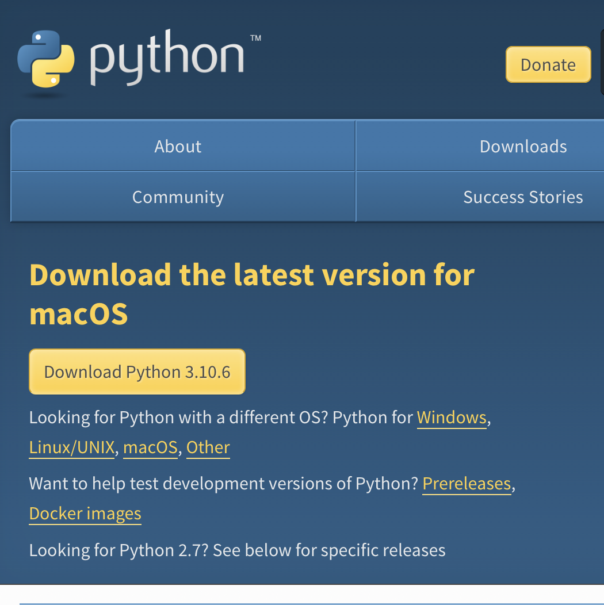
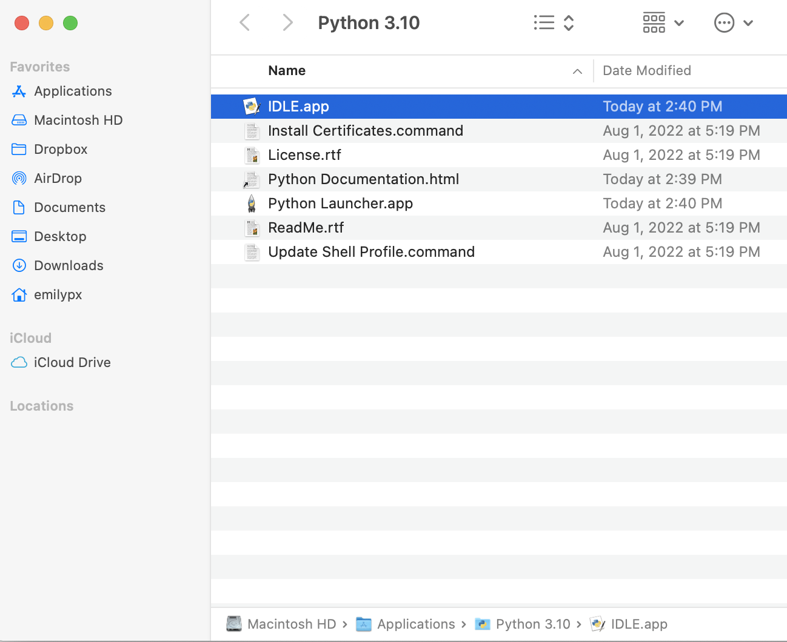

# Problem Set 1: Getting Started

In this problem set you will do the following:

* Let me know more about youself, your background, and your interest in programming and computer science.
* Practice working with Slack, the app you will use to ask questions in this class instead of using email.
* Install Python (our programming language) and IDLE (the software you will use to write your Python programs).
* Write your first few lines of Python code within IDLE.

To receive full credit you must:

* Submit the PDF from Part 1 to Canvas.
* Complete the course survey from Part 2.
* Post a message on Slack for Part 3.
* Submit the screenshot from Part 5 to Canvas.

**All components of this problem set are due by Friday, September 2, by 11:59pm Boston time.**

---

### Part 1: Make a personalized slide

1. Using PowerPoint, Keynote, or Google Slides, create a single landscape mode **PDF** that contains the following information.

* Your name as it appears in Canvas.
* The name you prefer to be called.
* A recent photo of you to help me learn what you look like.
* One fun fact about yourself.

2. Submit this **PDF** to Canvas for Problem Set 1. *Note: You will not get full credit if you submit a PowerPoint or a link to a Google Slides presentation. You must submit a **PDF**.*

### Part 2: Take the course survey
[Take this short survey.](https://forms.gle/iHYSEMEgyb3qoj3a6)

### Part 3: Get started on Slack
[Follow this link to join the Slack organization for this class](https://join.slack.com/t/cs1101-04spring2021/shared_invite/zt-l6ivsjqe-c~~k2eLVXRBo64opHrBRhw). Create your account if you don't have one and feel free to use a pseudonym for your username. Then post a message in the #general channel. Don't forget to @prudhome if you need my attention.

### Part 4: Install Python (if you didn't already install it in class)

1. Download Python for your operating system by clicking the big yellow "Download Python" button found on this webpage: https://www.python.org/downloads/. 



2. Double click on the downloaded file to install Python on your computer. Answer the questions that the installer asks you and keep clicking the "Continue" button. You might have to enter your computer's password to complete the installation.

*Important note for Windows users: You **must** check the box in the first dialogue window that says "Add Python 3.9 to PATH"!*

3. After installation is complete, your computer will probably open a window showing you where the various Python components were installed. On a Mac, it's in Applications by default. In Windows, the default location is in Programs. If you are having trouble finding the Python components you just installed, you can always search for "python" or "idle" the way you would search for any other file or program. Here's a screenshot from my Mac showing where the installer installed Python. 



4. Make a shortcut to the IDLE application to your desktop so you always know where to find it.


 ### Part 5: Type some Python code!

1. Launch the **IDLE** application (*not* python.exe or Python launcher.app).

2. This will open a window that looks something like this.


 
3. Next to the ``>>>`` type a mathematical expression, like ``2+7`` or ``56/8``. Then hit return.

4. Now type your own personalized greeting to me and the TAs using the ``print`` command. Here's an example, below, of how the command should look, but you will replace ``Hello, world!`` with your own greeting. Don't forget to hit return after you type your command.

```print("Hello, world!")```

5. Take a screenshot of your IDLE window showing that you typed these commands, and submit it to the Canvas assignment for Problem Set 1.

---

**Reminder:** To receive full credit you must

* Submit the slide from Part 1 to Canvas.
* Complete the course survey from Part 2.
* Post a message on Slack for Part 3.
* Submit the screenshot from Part 5 to Canvas.

**All components of this problem set are due by Friday, September 2, by 11:59pm Boston time.**

---
